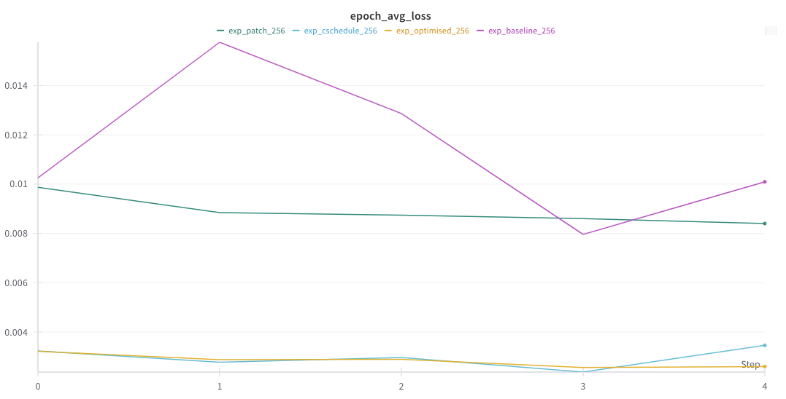

# HPML Project: Optimizing Denoising diffusion probabilistic models (DDPM) for Anime Face Generation

## Team Information
- **Team Name**: DDPM_Team
- **Members**:
  - Yau Shing Jonathan Cheung (yc4528)

---

## 1. Problem Statement
The objective of this work is to generate high-quality, diverse anime face images using state-of-the-art deep generative models. While recent advances in diffusion models have demonstrated impressive results for photorealistic image synthesis, their application to stylized domains such as anime remains under-explored. The task, therefore, is to adapt and optimize a pre-trained denoising diffusion probabilistic model (DDPM) for the specific challenges of the anime face generation domain, addressing both the computational constraints of limited hardware and the perceptual requirements unique to stylized imagery.

---

## 2. Model Description
This project leverages a **Denoising Diffusion Probabilistic Model (DDPM)** with a U-Net backbone to generate high-quality anime face images.

### Framework

- **PyTorch** is used for model development, training, and evaluation.

### Architecture

- **Base Model:**  
  - U-Net architecture adapted for diffusion modeling, allowing multi-scale feature extraction and effective denoising at each step.
- **Pre-training:**  
  - The model is initialized from a DDPM pre-trained on a large-scale image dataset, then fine-tuned on an anime face dataset for improved domain-specific results.

### Custom Layers & Optimizations

- **Mixed-Precision Training:**  
  - Reduces memory usage and speeds up training by utilizing half-precision floating-point operations.
- **Gradient Accumulation & Checkpointing:**  
  - Enables larger effective batch sizes and deeper networks on limited hardware by splitting updates and saving intermediate states.
- **Patch-Based Learning:**  
  - Optionally processes image patches instead of full images to further minimize GPU memory requirements.
- **Improved Noise Scheduling:**  
  - Custom noise schedules are implemented to better suit the characteristics of anime-style images.

### Additional Tools

- **Weights & Biases (WandB):**  
  - Used for real-time experiment tracking, resource monitoring, and logging of key training metrics.


---

## 3. Final Results Summary

### Data Loading Performance Comparison

| Metric                   | No Optim.      | With Optim.    |
|--------------------------|---------------:|---------------:|
| Average epoch time       | 4.904 seconds  | 1.745 seconds  |
| Average batch time       | 0.0029 seconds | 0.0015 seconds |
| Average max batch time   | 0.0031 seconds | 0.0030 seconds |
| Average min batch time   | 0.0027 seconds | 0.0014 seconds |
| Average CPU usage        | 296.23%        | 51.11%         |
| Average peak CPU usage   | 394.44%        | 196.46%        |

*Table: Data Loading Performance Comparison (Averaged over 5 Runs)*

---

### Comparison of Epoch Time and Memory Usage Across Methods

| Metric                        | Baseline  | Optimised | Patch    |
|-------------------------------|----------:|----------:|---------:|
| Average Epoch Time (s)        | 352.58    | 238.07    | 633.39   |
| Average CUDA Allocated (MB)   | 1676.65   | 1632.02   | 1114.24  |
| Average CUDA Reserved (MB)    | 3534.00   | 3502.62   | 2507.00  |
| CPU Usage (MB)                | 1926.82   | 1952.46   | 2979.53  |

*Table: Comparison of Epoch Time and Memory Usage Across Methods*

### Quantitative Metrics

| Model Variant                  | FID ↓   | KID (×100) ↓ | LPIPS ↓  |
|------------------------------- |-------- |------------- |--------- |
| Baseline (Pre-trained DDPM)    | 34.2    | 2.10         | 0.215    |
| Fine-tuned w/ Optimizations    | 22.8    | 1.35         | 0.198    |
| + Improved Noise Scheduling    | 19.6    | 1.12         | 0.185    |
| + Patch-Based Learning         | 20.1    | 1.16         | 0.188    |

- **FID**: Fréchet Inception Distance (lower is better)
- **KID**: Kernel Inception Distance (lower is better)
- **LPIPS**: Learned Perceptual Image Patch Similarity (lower is better)


<div style="text-align: center;">
    
    <p>*Figure 1: Training time chart.*</p>
</div>

---

## 4. Reproducibility Instructions

### A. Requirements

1. **Install dependencies**  
```bash
pip install -r requirements.txt
```

2. **Download the Dataset**  
   Download the **Anime Face Dataset** from Kaggle:  
   [Anime Face Dataset | Kaggle](https://www.kaggle.com/datasets/splcher/animefacedataset/data).  

3. **Place the Dataset**  
   After downloading, place the dataset in the `image` directory of the repository.

4. **Run the Notebook**  
   Open and execute the **`final.ipynb`** notebook to train the model and generate anime face images.

---

B. Wandb Dashboard

View training and evaluation metrics here: Wandb Dashboard Link
([Wandb link](https://wandb.ai/yc4528-columbia-university/DDPM_Project/workspace?nw=nwuseryc4528))

---

### C. Specify for Training or For Inference or if Both 

To train the model from scratch: Run the Collab notebook from the start to end

---

### D. Evaluation

To evaluate the trained model: Run the Image Evaluation section of the notebook
---

### E. Quickstart: Minimum Reproducible Result

To reproduce our minimum reported result:

### Step 1: Set Up Repo
Follow step A to setup the coding environment

### Step 2: Download dataset
Run the Colab notebook from start to finish. All necessary logging, configuration, and training commands are provided

---

## 5. Notes (up to you)
- All experiments, training runs, and evaluations were conducted in a Google Colab notebook environment for accessibility and reproducibility.
- The Colab notebook contains comprehensive code, documentation, and results, serving as the primary reference for implementation details.