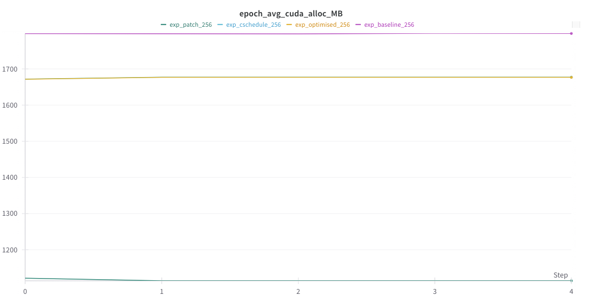
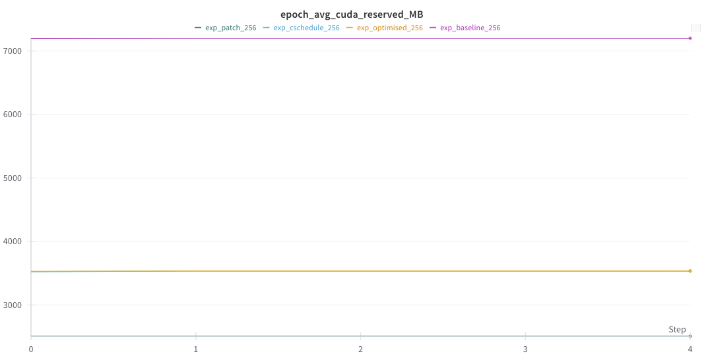

# Optimising DDPM for Anime Face Generation

## **Project Description**
This project aims to fine-tune a pretrained **Denoising Diffusion Probabilistic Model (DDPM)** on the **CelebA face images** for generating high-quality **anime face images**. The focus is on improving the efficiency and quality of the generation process while ensuring better alignment with the desired **anime style**.

### **Key Improvement Methods**
We implemented five major techniques to optimize training performance and output quality:

1. **Improved Data Loading**  
   - Enhanced the data pipeline to ensure faster and smoother processing during training, reducing bottlenecks in data handling.

2. **Mixed Precision Training**  
   - Reduced memory usage and increased computational speed by leveraging half-precision floating-point calculations (FP16), without sacrificing model performance.

3. **Gradient Checkpointing**  
   - Reduced memory consumption by recomputing intermediate activations during backpropagation, enabling training on larger batch sizes.

4. **Gradient Accumulation**  
   - Simulated larger batch sizes when memory was constrained, ensuring stable and effective gradient updates across smaller mini-batches.

5. **Patch-Based Training**  
   - Focused training on localized features, improving the model's ability to capture fine details of the anime facial style.

### **Optimized Noise Schedule**
Additionally, we implemented an optimized noise schedule for DDPM, refining the denoising process to improve the quality of generated images. This change has a significant positive impact on metrics like **FID**, **KID**, and **LPIPS**.

For detailed implementation and performance results, including comparisons of each method, please refer to the notebook.

---

## **Code Repository Outline**
- All the code for the project is included in the **`final.ipynb`** notebook.
- The **Anime Face Dataset** is stored in the `data` directory after downloading it.

---

## **Instructions to Execute the Code**

1. **Download the Dataset**  
   Download the **Anime Face Dataset** from Kaggle:  
   [Anime Face Dataset | Kaggle](https://www.kaggle.com/datasets/splcher/animefacedataset/data).  

2. **Place the Dataset**  
   After downloading, place the dataset in the `image` directory of the repository.

3. **Run the Notebook**  
   Open and execute the **`final.ipynb`** notebook to train the model and generate anime face images.

---

## **Results**
We tracked the following metrics using **Weights & Biases (WandB):**
1. **Training Time:**  
   Significant reduction in training time due to improved data loading and mixed precision training.

2. **Memory Usage:**  
   Optimized memory usage with gradient checkpointing and accumulation, enabling larger batch sizes.

3. **Generated Image Quality:**  
   Improved FID, KID, and LPIPS scores, indicating better quality and perceptual similarity of the generated anime faces.

### **Charts and Tables**  
Below are the **WandB charts** showcasing improvements in training time, memory usage, and image quality metrics:

    
    
*Figure 1: Training time chart.*

    
    
*Figure 2: Memory usage reduction.*

    
    
*Figure 3: Memory usage reserved.*

---

## **WandB Project**
For a detailed view of the training process and results, visit our **WandB project board**:  
[WandB Project Board](https://wandb.ai/yc4528-columbia-university/DDPM_Project?nw=nwuseryc4528)

Invited Team Access to TAs and Prof

---